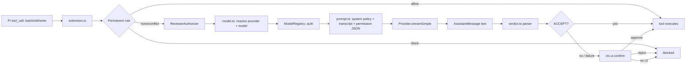
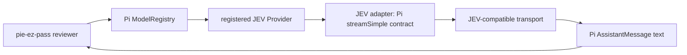
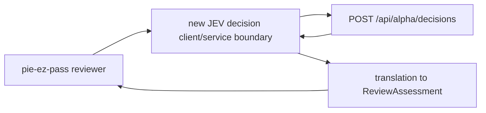

# pie-ez-pass: model/provider architecture

**Finding.** pie-ez-pass is a Pi permission gate. It does not call an arbitrary decision API. It resolves a Pi `Provider` + `Model`, sends a text review through Pi AI's `streamSimple`, parses a local `ACCEPT`/`ESCALATE` assessment, then uses Pi's native confirmation UI.

## 1. Current architecture and full path

| Stage | Evidence-backed behaviour |
|---|---|
| Intercept | `src/extension.ts`: `tool_call`; only `bash`, `edit`, `write` are reviewed. |
| Pre-model gate | Permanent rules can accept or block before model review. Bash uses `command`; edit/write use `path`. |
| Input | Tool details plus `sessionManager.buildContextEntries()` become a review prompt. Transcript/evidence is labelled untrusted. |
| Model call | Resolve provider/model; resolve auth; call `provider.streamSimple(...).result()`. Three attempts by default; delays 250 ms and 1,000 ms. |
| Output | Only text blocks from the Pi `AssistantMessage` are joined and parsed by `parseReviewAssessment`; the parser requires a JSON object with `outcome` = `ACCEPT` or `ESCALATE` and non-empty `rationale` (maximum 4,000 characters). |
| Decision | Parsed `ACCEPT` returns `{}`. Otherwise rationale is appended to the native confirmation prompt. |
| Safety boundary | Provider/model/auth/parser/timeout/cancellation/internal failures escalate. No UI means block. Human rejection means block. |

## 2. Exact current model-provider contract

### Configuration and lookup

| Contract | Current value/rule |
|---|---|
| Config fields | `provider`, `model`, `reasoning`, `timeoutMs`, optional `additionalPolicy`; global-only `rules`. |
| Defaults | `openai-codex` / `codex-auto-review`; reasoning `low`; timeout 90,000 ms; schema max 300,000 ms. |
| Load/merge | Global `~/.pi/agent/extensions/pie-ez-pass/config.json` plus project `.pi/extensions/pie-ez-pass/config.json`; project model/reviewer fields override global fields. `PI_CODING_AGENT_DIR` can replace the agent directory. |
| Provider lookup | `registry.getProvider(providerId)` when available; compatibility fallback to `registry.runtime.getProvider`. Missing provider => `provider-unresolved`. |
| Model lookup | `registry.find(provider, model)`. Missing non-default model => `model-unresolved`. |
| Default synthesis | For exactly `openai-codex` + `codex-auto-review`, copy a registered `openai-codex-responses` model template, then set id/name/reasoning/input. No network discovery is performed by pie-ez-pass. |

### Invocation and response

| Boundary | Contract actually used |
|---|---|
| Provider | Pi AI `Provider<Api>`: metadata, `getModels()`, `streamSimple(model, context, options)`. |
| Context | System prompt plus one user message containing the rendered transcript and permission-request JSON. |
| Options | `maxRetries: 0`, max output tokens 1,000, abort signal, remaining timeout, auth key/headers/env, and configured reasoning when model supports reasoning and config is not `off`. |
| Return | Pi AI `AssistantMessage` from the stream's `.result()`. `stopReason` `error` or `aborted` is treated as provider failure; otherwise text content is parsed locally. |
| Auth | `registry.getApiKeyAndHeaders(model)`; `{ok:false}` or thrown/aborted resolution => auth/timeout/cancelled failure. |
| Failure classes | `provider-unresolved`, `model-unresolved`, `auth-unresolved`, `provider-error`, `invalid-response`, `timeout`, `cancelled`, `internal-error`. All lead to escalation, then native confirmation or fail-closed block. |

Relevant Pi metadata on `Model<Api>` includes `id`, `name`, `api`, `provider`, `baseUrl`, `reasoning`, `input`, `cost`, `contextWindow`, `maxTokens`, optional headers and compatibility settings. pie-ez-pass uses the model's provider, API, and reasoning metadata; its synthesis changes only id, name, reasoning, and input while retaining the template's other metadata.

## 3. JEV branches

The supplied JEV facts establish one external HTTP shape: `POST https://openrouter.ai/api/alpha/decisions`, bearer API key, decision `state`, typed `questions`, and a response with `answers`, per-answer values/probabilities/confidence, usage, id, and provider. No other JEV behaviour is assumed.

### A — Pi-native provider/model registration

### B — separate external/non-Pi-native JEV service

| Dimension | A: Pi-native | B: external/non-Pi-native |
|---|---|---|
| Components/change set | Register provider/model via Pi extension/provider facilities; implement adapter producing Pi stream/message semantics; configure provider/model. | Add a JEV client/service abstraction, HTTP/auth/timeout handling, JEV request construction, response validation, and translation into the existing review assessment. |
| Interface boundary | `ModelRegistry` → `Provider` → `streamSimple` → `AssistantMessage`. | Reviewer → new JEV client → supplied decision endpoint response; no Pi provider required. |
| Loading/config | Pi provider registration plus pie-ez-pass `provider`/`model`; model metadata must satisfy Pi's model contract. | New config surface is required for endpoint and credential selection; current schema has no endpoint, API-key, question, or JEV fields. |
| Translation responsibility | Provider adapter translates Pi context/options to the provider transport and returns Pi `AssistantMessage`; existing local verdict parser still must receive the expected assessment text. | New client/translator must map permission evidence to JEV `state`/`questions`, then map JEV answers to `ReviewAssessment`; exact mapping is a product decision, not present in current code or supplied JEV facts. |
| Test gates | Provider/model resolution; auth; stream success/error; Pi message text; model metadata; timeout/cancel; verdict parsing; fail-closed confirmation. | Request serialization and auth; exact supplied response fixtures; malformed/partial answer handling; timeout/cancel; translation semantics; failure escalation and fail-closed confirmation. |
| Primary risks | Incorrect Pi API/model metadata; adapter emits unusable text; auth and stream error semantics; verdict format mismatch. | New security/transport boundary; unclear mapping from multi-question JEV answers to binary `ACCEPT`/`ESCALATE`; credential/config lifecycle; unverified endpoint error semantics. |

## 4. Why branch B does not exist today

The current abstraction boundary is explicit:

1. `src/extension.ts` injects Pi's `context.modelRegistry` into the reviewer and listens only to Pi lifecycle/tool events.
2. `src/model.ts` resolves only a Pi `Provider` and Pi `Model` through `getProvider`, `find`, `getAll`, and `getApiKeyAndHeaders`.
3. `src/reviewer.ts` calls only `resolved.value.provider.streamSimple(...)`; it has no HTTP client, URL, JEV request type, JEV response type, or decision-service interface.
4. `src/config.ts` and `schemas/config.schema.json` expose only provider/model/reasoning/timeout/policy/rules. They contain no JEV endpoint, question schema, or JEV credential field.
5. The reviewer expects text that `parseReviewAssessment` can turn into the existing local assessment. The supplied JEV response is structured `answers`, not that local assessment shape.

Therefore B is not a hidden alternate path. It cannot be enabled by changing `provider` or `model` alone. It requires a new client boundary (or an equivalent injected decision adapter), configuration/auth handling, JEV request/response validation, and an explicit translation from JEV's structured answers to the extension's binary permission verdict. The supplied JEV example proves the endpoint and response fields only; it does not define that translation.

## Sources inspected

- `README.md`
- `schemas/config.schema.json`
- `src/config.ts`
- `src/model.ts`
- `src/reviewer.ts`
- Direct integration: `src/extension.ts`, `src/prompt.ts`, `src/review-types.ts`
- Pi APIs: `@earendil-works/pi-ai` `models.d.ts`, `types.d.ts`; Pi coding-agent `model-registry.d.ts`, `provider-composer.d.ts`, extension provider types

### Revision Log

- Initial evidence-based inspection. No repository code changed.
