# Implementation dependency graph comparison

Pinned source: child commit `a9d4892` (before `.scratch/` deletion).
GitHub: current native `dependencies/blocked_by` edges for issues `#29`–`#44`.

## Side-by-side Mermaid diagram

```mermaid
flowchart TB
  subgraph gh["Current GitHub linkages"]
    gh1["#29 Launch a subagent to a Zellij…"]
    gh2["#30 List subagents and classify l…"]
    gh3["#31 Send prompts and respond to c…"]
    gh4["#32 Kill a subagent and tear down…"]
    gh5["#33 TTY prompt detection and inte…"]
    gh6["#34 Disposable git worktree isola…"]
    gh7["#35 Multi-engine adapters (claude…"]
    gh8["#36 Primary Dispatch Guard"]
    gh9["#37 Transactional relaunch contro…"]
    gh10["#38 Zero-token supervision loop &…"]
    gh11["#39 Session-start fleet recovery …"]
    gh12["#40 Declarative dispatch config (…"]
    gh13["#41 Decisions-backlog side-loop (…"]
    gh14["#42 Fleet status widget & steer a…"]
    gh15["#43 Stuck/wedge recovery ladder"]
    gh16["#44 Set up the project scaffold"]
    gh1 --> gh2
    gh1 --> gh3
    gh1 --> gh4
    gh1 --> gh6
    gh1 --> gh7
    gh1 --> gh8
    gh1 --> gh12
    gh2 --> gh7
    gh2 --> gh10
    gh2 --> gh11
    gh3 --> gh4
    gh3 --> gh5
    gh3 --> gh9
    gh3 --> gh13
    gh3 --> gh14
    gh4 --> gh6
    gh4 --> gh15
    gh5 --> gh13
    gh5 --> gh15
    gh6 --> gh9
    gh7 --> gh12
    gh9 --> gh15
    gh10 --> gh11
    gh10 --> gh13
    gh10 --> gh14
    gh16 --> gh1
  end
  subgraph src["Pinned .scratch dependency text"]
    src1["01 Launch a subagent to a Zellij…"]
    src2["02 List subagents and classify l…"]
    src3["03 Send prompts and respond to c…"]
    src4["04 Kill a subagent and tear down…"]
    src5["05 TTY prompt detection and inte…"]
    src6["06 Disposable git worktree isola…"]
    src7["07 Multi-engine adapters (claude…"]
    src8["08 Primary Dispatch Guard"]
    src9["09 Transactional relaunch contro…"]
    src10["10 Zero-token supervision loop &…"]
    src11["11 Session-start fleet recovery …"]
    src12["12 Declarative dispatch config (…"]
    src13["13 Decisions-backlog side-loop (…"]
    src14["14 Fleet status widget & steer a…"]
    src15["15 Stuck/wedge recovery ladder"]
    src16["16 Set up the project scaffold"]
    src1 --> src2
    src1 --> src3
    src1 --> src4
    src1 --> src6
    src1 --> src7
    src1 --> src8
    src1 --> src12
    src2 --> src7
    src2 --> src10
    src2 --> src11
    src3 --> src4
    src3 --> src5
    src3 --> src9
    src3 --> src13
    src3 --> src14
    src4 --> src6
    src4 --> src15
    src5 --> src13
    src5 --> src15
    src6 --> src9
    src7 --> src12
    src9 --> src15
    src10 --> src11
    src10 --> src13
    src10 --> src14
    src16 --> src1
  end
  classDef source fill:#fff4cc,stroke:#9a6700;
  classDef github fill:#dbeafe,stroke:#1d4ed8;
  class gh1,gh2,gh3,gh4,gh5,gh6,gh7,gh8,gh9,gh10,gh11,gh12,gh13,gh14,gh15,gh16 github;
  class src1,src2,src3,src4,src5,src6,src7,src8,src9,src10,src11,src12,src13,src14,src15,src16 source;
```

## Edge comparison

- Source edges: `26`
- GitHub edges: `26`
- Match: `True`

The graphs match exactly. Each local `Blocked by` relationship is represented by the corresponding native GitHub dependency, with local ticket `01` mapped to GitHub issue `#29` and local ticket `16` mapped to `#44`.

## Interpretation

The dependency mapping is correct. The apparent GitHub issue-number shift is expected: GitHub assigned issues `#29`–`#44` to local tickets `01`–`16`; the native edges preserve the relationships rather than the local numbers.
